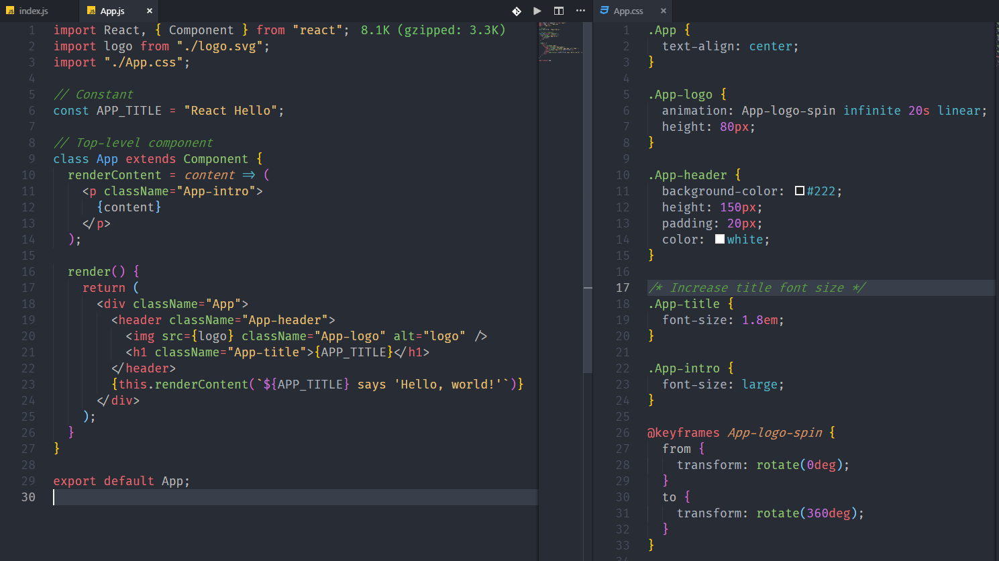

# One Monokai Theme, Tweaked

[](https://marketplace.visualstudio.com/items?itemName=alanmunson.one-monokai-tweaked) [](https://marketplace.visualstudio.com/items?itemName=alanmunson.one-monokai-tweaked) [](https://marketplace.visualstudio.com/items?itemName=alanmunson.one-monokai-tweaked) [](https://github.com/AlanMunson/vscode-one-monokai-tweaked)

A cross between Monokai and One Dark theme, with some additional styling tweaks.
Forked from [Joshua Azemoh's One Monokai](https://marketplace.visualstudio.com/items?itemName=azemoh.one-monokai) extension.

## Install

press `ctl/command + shift + p` to launch the command palette then run

```
ext install one-monokai-tweaked
```

## Screenshot

Screenshot of JavaScript / React and CSS



## Change log

You can take a look at the change log [here](https://github.com/AlanMunson/vscode-one-monokai-tweaked/blob/master/CHANGELOG.md)
